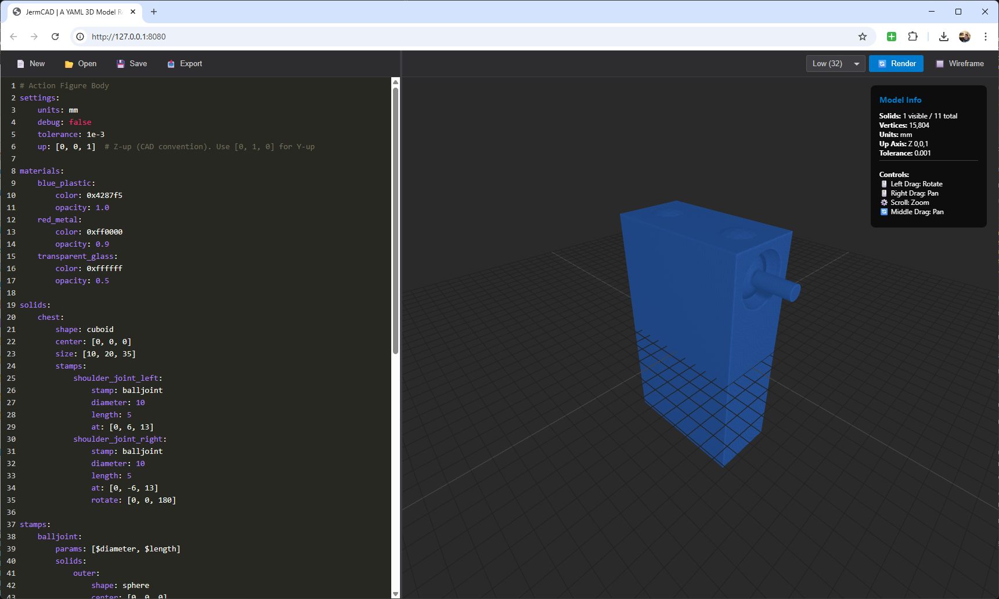

# JermCAD

A browser-based 3D CAD model renderer that lets you design 3D models using YAML syntax. Define geometric shapes, apply boolean operations, and visualize your designs in real-time with export capabilities.


## Features

- **YAML-Based Modeling**: Define 3D models using simple YAML syntax
- **Multiple Shape Types**: Cuboid, cylinder, sphere, and extrusion shapes
- **Boolean Operations**: Union, difference, and intersection operations
- **Stamps**: Reusable parametric shape templates for complex assemblies
- **Property References**: Reference properties from other solids to maintain alignment and consistency
- **3D Visualization**: Interactive 3D viewer with camera controls
- **STL Export**: Export your models for 3D printing
- **Coordinate System Support**: Z-up (CAD convention) or Y-up (traditional 3D)
- **Wireframe Mode**: Toggle wireframe view for better visualization
- **Real-time Rendering**: See changes instantly as you edit
- **Quality Settings**: Adjustable render quality for optimal performance (Low/Med/High/Ultra)

## Getting Started

### Prerequisites

- Node.js (v14 or higher)
- npm (Node Package Manager)

### Installation

1. Clone or download this repository
2. Install dependencies:
   ```bash
   npm install
   ```

### Running the Application

Start the development server:
```bash
npm start
```

This will start a local server at `http://localhost:8080` and automatically open it in your browser.

Alternatively, you can use:
```bash
npm run serve
```
This starts the server without automatically opening the browser.

## Usage

### Basic Workflow

1. **Edit the YAML** in the left panel editor
2. **Click "🔄 Render Model"** or press `Ctrl+Enter` to render your changes
3. **View your model** in the 3D viewer on the right
4. **Export** as STL when ready using the "💾 Export STL" button

### Camera Controls

- **Left Mouse Drag**: Rotate the camera around the model
- **Right Mouse Drag**: Pan the view
- **Middle Mouse Drag**: Pan the view (alternative)
- **Scroll Wheel**: Zoom in/out
- **Reset Camera Button**: Return to default view

### YAML Model Structure

A basic model consists of:

```yaml
settings:
    units: mm
    tolerance: 1e-3
    up: [0, 0, 1]  # Z-up (CAD convention) or [0, 1, 0] for Y-up
    debug: false   # Enable verbose console logging (default: false)

materials:
    my_material:
        color: 0xff0000  # Hex color code
        opacity: 1.0     # 0.0 (transparent) to 1.0 (opaque)

solids:
    my_shape:
        shape: cuboid
        center: [0, 0, 0]
        size: [10, 8, 3]
        material: my_material  # Reference to material defined above

final:
    material: my_material  # Apply material to the final merged mesh
    # OR use direct properties:
    # color: 0x4287f5
    # opacity: 1.0
```

### Materials

Materials allow you to define reusable color and opacity settings that can be referenced by multiple solids.

```yaml
materials:
    blue_plastic:
        color: 0x4287f5
        opacity: 1.0
    red_metal:
        color: 0xff0000
        opacity: 0.9
    transparent_glass:
        color: 0xffffff
        opacity: 0.5

solids:
    base:
        shape: cuboid
        center: [0, 0, 0]
        size: [10, 10, 5]
        material: blue_plastic  # Use the material defined above
    
    handle:
        shape: cylinder
        center: [0, 0, 5]
        diameter: 2
        length: 10
        material: red_metal  # Different material
```

**Material Properties:**
- `color`: Hex color code (e.g., `0xff0000` for red, `0x4287f5` for blue)
- `opacity`: Number between 0.0 (fully transparent) and 1.0 (fully opaque)

**Using Materials vs Direct Properties:**
- You can reference a material using `material: material_name`
- OR you can use direct `color` and `opacity` properties on the solid (backward compatible)
- If both are specified, the material takes precedence

### Final Mesh

The `final` section allows you to merge all visible meshes into a single final mesh and apply a material to it. This is useful when you want to show only the final result with a unified appearance.

```yaml
final:
    material: blue_plastic  # Reference to a material
    # OR use direct properties:
    # color: 0x4287f5
    # opacity: 1.0
```

**How it works:**
- After all solids are created and boolean operations are applied, all visible meshes are merged into one
- The material from the `final` section is applied to this merged mesh
- All individual meshes are hidden, showing only the final merged result
- If no `final` section is provided, individual meshes are shown as before

**Properties:**
- `material`: Name of a material defined in the `materials` section
- `color`: Hex color code (alternative to material)
- `opacity`: Number between 0.0 and 1.0 (alternative to material)

### Shape Types

#### Cuboid
```yaml
my_box:
    shape: cuboid
    center: [0, 0, 0]
    size: [width, depth, height]
    material: my_material  # Reference to material, OR use direct properties:
    # color: 0xff0000  # Optional hex color (if no material specified)
    # opacity: 0.8     # Optional (0-1) (if no material specified)
```

#### Cylinder
```yaml
my_cylinder:
    shape: cylinder
    center: [0, 0, 0]
    diameter: 5
    length: 10
    rotation: [90, 0, 0]  # Optional rotation in degrees [x, y, z]
```

#### Sphere
```yaml
my_sphere:
    shape: sphere
    center: [0, 0, 0]
    diameter: 5
```

#### Extrusion
```yaml
my_extrusion:
    shape: extrusion
    center: [0, 0, 0]
    profile:
        type: circle    # or rect, poly
        diameter: 3     # for circle
        # OR
        size: [2, 2]    # for rect [width, height]
        # OR
        points: [[0,0], [1,0], [1,1], [0,1]]  # for poly
    length: 5
    rotation: [90, 0, 0]
```

### Boolean Operations

Boolean operations allow you to combine shapes using union, difference, and intersection. Operations are applied in the order listed.

#### Difference (Subtract)
```yaml
base:
    shape: cuboid
    center: [0, 0, 0]
    size: [10, 10, 5]
    modifiers:
        boolean:
            - difference: cutout_shape

cutout_shape:
    shape: cuboid
    center: [0, 0, -1]
    size: [5, 5, 3]
    visible: false  # Hidden objects used only for boolean ops
```

#### Union (Add)
```yaml
base:
    shape: cuboid
    center: [0, 0, 0]
    size: [10, 10, 5]
    modifiers:
        boolean:
            - union: addon_shape

addon_shape:
    shape: cylinder
    center: [0, 0, 5]
    diameter: 3
    length: 2
```

#### Multiple Operations
You can chain multiple boolean operations:
```yaml
base:
    shape: cuboid
    center: [0, 0, 0]
    size: [10, 10, 5]
    modifiers:
        boolean:
            - difference: cutout1
            - difference: cutout2
            - union: addon1
            - intersection: intersection_shape
```

### Transformations

All shapes support:
- **center**: `[x, y, z]` - Position of the shape
- **anchor**: `[x, y, z]` - Anchor point (values 0-1) that determines which point on the bounding box the center refers to. Default is `[0.5, 0.5, 0.5]` (geometric center)
- **rotation**: `[x, y, z]` - Rotation in degrees around each axis
- **color**: Hex color code (e.g., `0xff0000` for red)
- **opacity**: Number between 0 and 1
- **visible**: `true` or `false` - Hide shapes used only for boolean operations

#### Anchor Point

The `anchor` property allows you to control which point on the shape's bounding box the `center` position refers to:

- `[0, 0, 0]` - Bottom-left-back corner (minimum corner)
- `[0.5, 0.5, 0.5]` - Geometric center (default)
- `[1, 1, 1]` - Top-right-front corner (maximum corner)
- `[0, 0.5, 0.5]` - Bottom edge center
- `[1, 0, 0]` - Top-left-back corner

**Example:**
```yaml
box_at_corner:
    shape: cuboid
    size: [10, 10, 10]
    center: [0, 0, 0]
    anchor: [0, 0, 0]  # Position the bottom-left-back corner at [0, 0, 0]

box_at_top:
    shape: cuboid
    size: [10, 10, 10]
    center: [0, 0, 20]
    anchor: [0.5, 0.5, 1]  # Position the top face center at [0, 0, 20]
```

### Property References

You can reference properties from other solids by using the solid name as a value. This allows you to keep related shapes aligned and maintain consistency across your model.

**How it works:**
- When a solid name appears as a value, it automatically resolves to the corresponding property from that solid
- In arrays, the reference resolves to the element at the same index position
- References are resolved recursively, so you can chain references (A references B, B references C)

#### Array Element References

When a solid name appears in an array, it resolves to the corresponding array element from that solid's property:

```yaml
cable_holder:
    center: [0, 0, 3]
    diameter: 5

cable_cutout:
    center: [0, 0, cable_holder]  # Gets cable_holder.center[2] = 3
    diameter: 3
```

In this example, `cable_cutout.center` becomes `[0, 0, 3]` because `cable_holder` in the third position resolves to `cable_holder.center[2]`.

#### Direct Property References

When a solid name is used as a direct property value, it resolves to the same property from that solid:

```yaml
base_shape:
    center: [0, 0, 0]
    diameter: 10

aligned_shape:
    center: base_shape        # Gets base_shape.center = [0, 0, 0]
    diameter: base_shape      # Gets base_shape.diameter = 10
```

#### Common Use Cases

**Aligning shapes:**
```yaml
base:
    center: [0, 0, 0]
    size: [10, 10, 5]

cover:
    center: [0, 0, base]  # Aligns cover's Z position with base's top (base.center[2] + base.size[2]/2)
    size: [10, 10, 1]
```

**Reusing dimensions:**
```yaml
main_body:
    diameter: 20
    length: 50

inner_core:
    diameter: main_body      # Same diameter as main_body
    length: main_body        # Same length as main_body
```

**Chained references:**
```yaml
base:
    center: [0, 0, 0]

middle:
    center: [0, 0, base]    # References base.center[2]

top:
    center: [0, 0, middle]  # References middle.center[2], which resolves through base
```

**Note:** References must point to existing solids. Circular references are detected and prevented to avoid infinite loops.

### Stamps

Stamps are reusable parametric shape templates that allow you to define complex assemblies once and instantiate them multiple times with different parameters, positions, and rotations. This reduces code duplication and makes models easier to maintain and modify.

#### What are Stamps?

Stamps are like "blueprints" for complex shapes or assemblies. Instead of defining the same combination of shapes multiple times, you define it once as a stamp and then instantiate it wherever needed. Stamps support:
- **Parameters**: Define variables like `$diameter` and `$length` that can be set per instance
- **Multiple Solids**: A stamp can contain multiple solids that work together
- **Boolean Operations**: Stamps can include internal boolean operations between their solids
- **Parent Modifiers**: Apply boolean operations to the parent solid when the stamp is instantiated
- **Positioning**: Each instance can be placed at different locations using `at`
- **Rotation**: Each instance can be rotated independently using `rotate`

#### Why Use Stamps?

- **DRY Principle**: Define once, use many times - reduces code duplication
- **Consistency**: Ensure all instances of a shape are identical
- **Easy Updates**: Change the stamp definition once, all instances update
- **Parametric Design**: Create families of similar shapes with different sizes
- **Complex Assemblies**: Build reusable components like joints, connectors, or mechanical parts

#### How Stamps Work

Stamps follow a three-step process:
1. **Define** the stamp template with parameters and shapes
2. **Instantiate** the stamp on a solid with specific parameter values
3. **Expand** - the system automatically converts stamp instances into actual solids

#### Defining Stamps

Stamps are defined in a `stamps` section at the root level of your YAML:

```yaml
stamps:
    my_stamp:
        params: [$param1, $param2]  # Optional: define parameters
        solids:
            shape1:
                shape: sphere
                center: [0, 0, 0]
                diameter: $param1
            shape2:
                shape: cylinder
                center: [0, $param1 / 2, 0]
                diameter: $param2
                length: $param1
        parent:
            modifiers:
                boolean:
                    - union: shape1
                    - union: shape2
```

**Stamp Structure:**
- `params`: (Optional) Array of parameter names with `$` prefix (e.g., `[$diameter, $length]`)
- `solids`: Dictionary of solids that make up the stamp (can reference parameters)
- `parent`: (Optional) Modifiers to apply to the parent solid when instantiated

**Parameter Expressions:**
Parameters can be used in mathematical expressions:
- `$diameter` - Simple parameter reference
- `$diameter * 0.75` - Multiplication
- `$diameter * 0.333 + $length / 2` - Complex expressions with multiple operations
- Expressions support `+`, `-`, `*`, `/`, and parentheses

**Shape Centers in Stamps:**
- Shapes within stamps are defined relative to `[0, 0, 0]` (the stamp origin)
- When instantiated, all shapes are translated to the `at` position
- If rotation is specified, shapes rotate around the stamp origin before translation

#### Instantiating Stamps

Use the `stamps` property on any solid to instantiate stamp templates:

```yaml
solids:
    my_part:
        shape: cuboid
        size: [10, 10, 10]
        stamps:
            instance1:
                stamp: my_stamp
                param1: 5
                param2: 3
                at: [0, 0, 5]
            instance2:
                stamp: my_stamp
                param1: 8
                param2: 4
                at: [10, 0, 5]
                rotate: [0, 0, 90]
```

**Stamp Instance Properties:**
- `stamp`: Name of the stamp to instantiate (required)
- `at`: Position `[x, y, z]` where the stamp should be placed (default: `[0, 0, 0]`)
- `rotate`: Rotation `[x, y, z]` in degrees around each axis (default: `[0, 0, 0]`)
- Any other properties: Parameter values (e.g., `diameter: 10`, `length: 5`)

**Parameter Passing:**
- Parameters can be passed by name: `diameter: 10` matches `$diameter`
- Parameters can be passed by position: If `params: [$diameter, $length]`, first property becomes `$diameter`, second becomes `$length`
- All properties except `stamp`, `at`, and `rotate` are treated as parameters

#### Complete Stamp Example

Here's a complete example showing a parametric ball joint stamp:

```yaml
solids:
    chest:
        shape: cuboid
        center: [0, 0, 0]
        size: [10, 20, 35]
        stamps:
            shoulder_joint_left:
                stamp: balljoint
                diameter: 10
                length: 5
                at: [0, 6, 13]
            shoulder_joint_right:
                stamp: balljoint
                diameter: 10
                length: 5
                at: [0, -6, 13]
                rotate: [0, 0, 180]  # Rotate 180° around Z axis

stamps:
    balljoint:
        params: [$diameter, $length]
        solids:
            outer:
                shape: sphere
                center: [0, 0, 0]
                diameter: $diameter
                modifiers:
                    boolean:
                        - difference: inner_cutout
                        - difference: inner_cutout2
            inner_cutout:
                shape: sphere
                center: [0, 0, 0]
                diameter: $diameter * 0.75
            inner_cutout2:
                shape: sphere
                center: [0, $diameter * 0.5, 0]
                diameter: $diameter * 0.75
            inner:
                shape: sphere
                center: [0, 0, 0]
                diameter: $diameter * 0.667
                modifiers:
                    boolean:
                        - union: inner_arm
            inner_arm:
                shape: cylinder
                center: [0, $diameter * 0.333 + $length / 2, 0]
                diameter: $diameter * 0.2
                length: $length
        parent:
            modifiers:
                boolean:
                    - union: outer
                    - difference: inner_cutout
                    - difference: inner_cutout2
```

**What Happens:**
1. The `balljoint` stamp defines a parametric joint with 5 shapes
2. `shoulder_joint_left` instantiates it at `[0, 6, 13]` with `diameter=10`, `length=5`
3. `shoulder_joint_right` instantiates the same stamp at `[0, -6, 13]` with 180° rotation
4. The system expands each instance into actual solids with unique names like `chest_shoulder_joint_left_outer`, `chest_shoulder_joint_right_outer`, etc.
5. Parent modifiers are applied to the `chest` solid, performing boolean operations with the stamp shapes

**Important Notes:**
- Stamp shapes are expanded into the `solids` section with unique names based on the parent solid and instance name
- All shapes in a stamp rotate together around the stamp's origin before translation
- Boolean operations within stamps are resolved before parent modifiers
- Stamps can reference other stamps (nested stamps)
- Parameter values can be numbers or mathematical expressions

### Complete Example

```yaml
settings:
    units: mm
    tolerance: 1e-3
    up: [0, 0, 1]  # Z-up

solids:
    base:
        shape: cuboid
        center: [0, 0, 0]
        size: [10, 8, 3]
        modifiers:
            boolean:
                - difference: base_cutout
                - union: cable_holder
    
    base_cutout:
        shape: cuboid
        center: [0, 0, -1]
        size: [9, 7, 1.5]
        visible: false
    
    cable_holder:
        shape: cylinder
        center: [0, 0, 3]
        diameter: 5
        length: 3
        modifiers:
            boolean:
                - difference: cable_cutout
    
    cable_cutout:
        shape: cylinder
        center: [0, 0, cable_holder]  # References cable_holder.center[2] = 3
        diameter: 3
        length: 5.5
        visible: false
```

## Tips

- **Dependency Resolution**: The system automatically resolves dependencies for boolean operations. Solids referenced in boolean operations are created first.
- **Property References**: Use property references to keep related shapes aligned. For example, `center: [0, 0, cable_holder]` automatically aligns the Z position with `cable_holder.center[2]`.
- **Invisible Solids**: Set `visible: false` on shapes used only for boolean operations to keep them hidden in the viewer.
- **Performance**: Complex models with many boolean operations may take longer to render. Be patient! Use the quality dropdown to adjust render quality for better performance during editing.
- **Keyboard Shortcut**: Use `Ctrl+Enter` in the editor to quickly render your model.
- **Debug Mode**: Set `debug: true` in settings to enable verbose console logging. This will show detailed information about each solid being created, its dependencies, boolean operations, and processing steps. Useful for troubleshooting complex models.
- **STL Export Quality**: STL exports always use ultra quality (256 segments) for maximum detail, regardless of your current viewport quality setting.

## Export

Click the "💾 Export STL" button to download your model as an STL file, ready for 3D printing or use in other CAD software.

## Troubleshooting

- **Model not rendering?** Check your YAML syntax for errors. The error panel will display specific issues.
- **Boolean operations not working?** Ensure all referenced solids are defined in the `solids` section. Enable `debug: true` in settings to see detailed console output about dependency resolution and boolean operations.
- **Camera stuck?** Use the "📷 Reset Camera" button to return to default view.
- **Performance issues?** Try simplifying your model or reducing the number of boolean operations.
- **Need more information?** Enable debug mode (`debug: true` in settings) and check the browser console (F12) for detailed logging about solid creation, dependencies, and processing steps.

## Technologies

- **Three.js**: 3D graphics library
- **three-bvh-csg**: Constructive Solid Geometry operations
- **js-yaml**: YAML parsing
- **Cursor**: Vibe-coding IDE

## License

ISC License

Copyright 2025 Jeremy A Boyd

Permission to use, copy, modify, and/or distribute this software for any purpose with or without fee is hereby granted, provided that the above copyright notice and this permission notice appear in all copies.

THE SOFTWARE IS PROVIDED "AS IS" AND THE AUTHOR DISCLAIMS ALL WARRANTIES WITH REGARD TO THIS SOFTWARE INCLUDING ALL IMPLIED WARRANTIES OF MERCHANTABILITY AND FITNESS. IN NO EVENT SHALL THE AUTHOR BE LIABLE FOR ANY SPECIAL, DIRECT, INDIRECT, OR CONSEQUENTIAL DAMAGES OR ANY DAMAGES WHATSOEVER RESULTING FROM LOSS OF USE, DATA OR PROFITS, WHETHER IN AN ACTION OF CONTRACT, NEGLIGENCE OR OTHER TORTIOUS ACTION, ARISING OUT OF OR IN CONNECTION WITH THE USE OR PERFORMANCE OF THIS SOFTWARE.